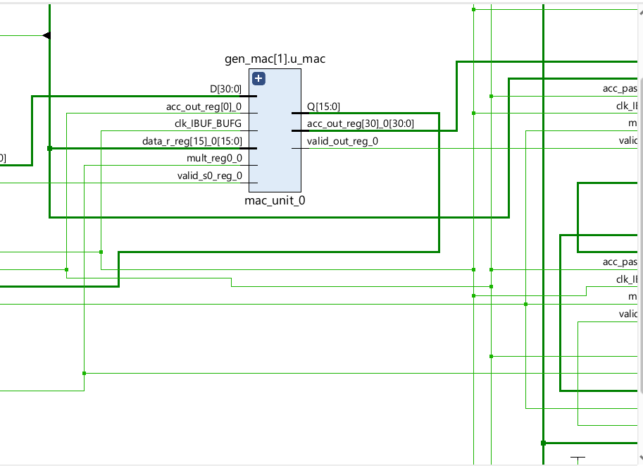
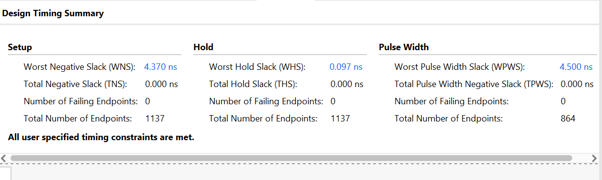
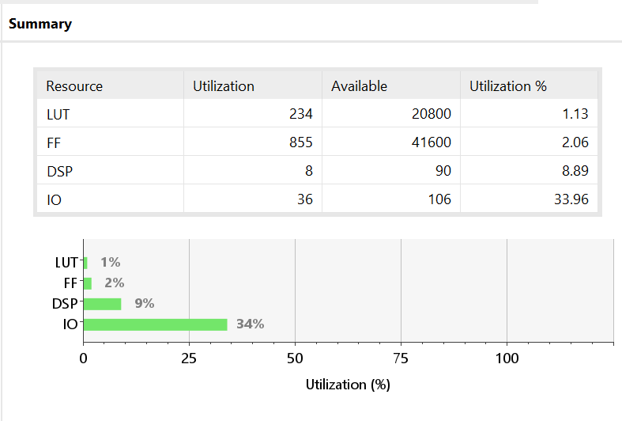
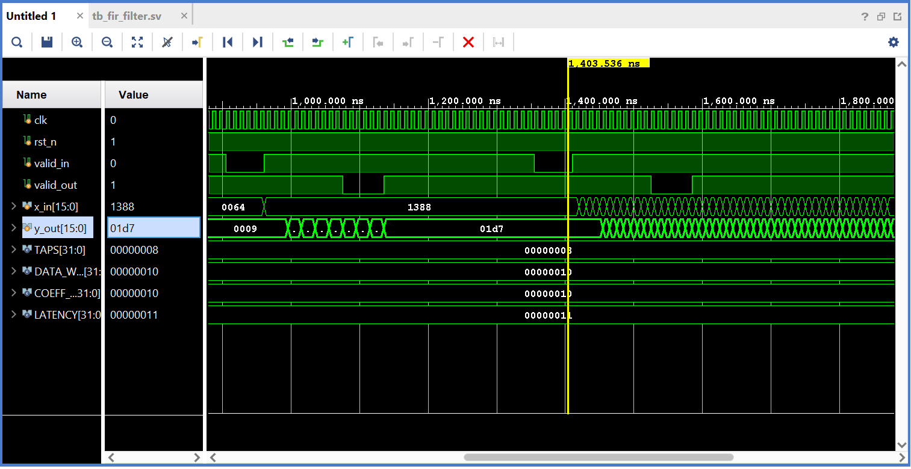

# fir_filter_fpga
Design and Timing Closure of a Pipelined N-Tap FIR Filter  using SystemVerilog on Xilinx Artix-7

## Results

### MAC Units

### Timing Summary

### Resource Utilization

### Simulation Waveform

